# 动作执行配置

## 使用场景

* 消息通知
* 设备联动
* 设备告警

## 概述

作用域：

* 设备级 （对单个设备起效）
* 组级别 （对分组设备有效）
* 项目级别 （对整个项目有效)

动作配置核心

* 触发条件 (执行的触发条件)
* 执行条件 (执行的前置条件)
* 过滤条件 (按条件过滤)
* 动作执行 (发送通知、设备调用、生成告警)

### 触发条件

当任意一个触发条件符合时，动作配置继续往下执行，现阶段仅支持设备作为触发条件。

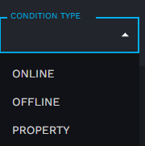

触发条件类型:

* 在线触发 （当设备上线时触发）
* 离线触发 （当设备离线时触发）
* 属性触发 （当设备上报属性符合条件时触发）

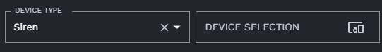

触发器生效设备选择(组级、项目级动作配置可设置)：  

用途：指定该触发器对某一指定类型设备有效，或指定设备有效

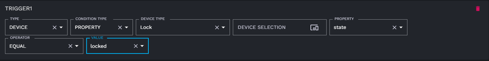

当选择条件类型为 **属性触发** 时，需要设置具体用于比较的属性、运算符、比较值。

### 执行条件

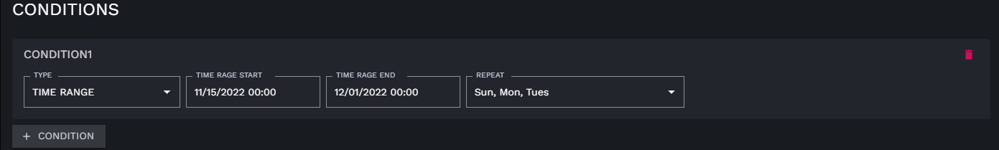

当满足条件时，动作配置继续往下执行，现阶段仅支持时间范围作为执行条件判断。

如果 **REPEAT** 没有设置代表，在日期范围内有效。  
如果 **REPEAT** 被设置，则代表在这个时间范围内的每星期几有效。

### 过滤条件

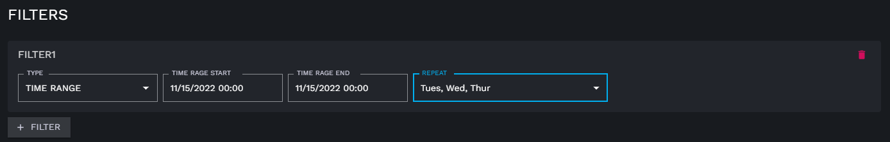

当满足条件时，动作配置**停止往下执行**，现阶段仅支持时间范围作为过滤条件判断。

如果 **REPEAT** 没有设置代表，在日期范围内有效。  
如果 **REPEAT** 被设置，则代表在这个时间范围内的每星期几有效。

### 执行动作

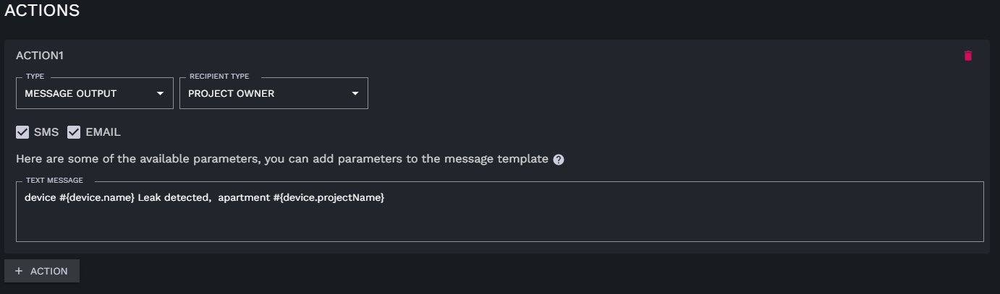

当动作类型为消息输出时，需要设置消息接收人、消息文本内容

消息接收人:

* PROJECT OWNER 项目负责人、绑定到该项目的所有人员
* FROM SELECTION 从用户列表中选择

消息通知方式：

* SMS
* EMAIL
* SMS & EMAIL

消息文本自定义：

内置变量：

* #{device.name} 设备名称
* #{device.deviceEUI} 设备device_eui
* #{device.type} 设备类型
* #{device.online} 设备在线离线状态
* #{device.timezone} 设备所在时区
* #{device.projectName} 设备关联项目名
* #{device.runtime.temperature} 温度（仅当设备有温度属性时有效）
* #{device.runtime.humidity} 湿度（仅当设备有湿度属性时有效）
* #{device.runtime.battery} 电量（仅当设备有电量属性时有效）
* #{device.runtime.state} 状态（仅当设备有状态属性时有效）

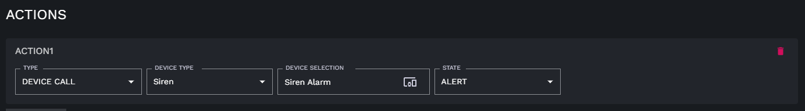

设备调用

支持设备：

* outlet
* Siren
* Speaker
* Manipulator

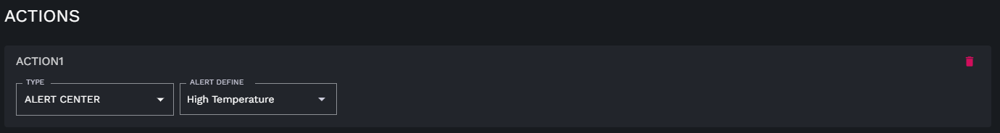

输出到告警中心，生成告警记录(需提前在告警中心创建告警定义，点击 **[此处](../alert)** 查看告警定义文档)

## 动作配置设置

### 设备级动作配置

#### 创建设备动作配置

1. 点击左侧菜单 **DEVICES** 进入设备管理页
2. 单击右侧设备列表，需要进行动作配置设置的设备记录

 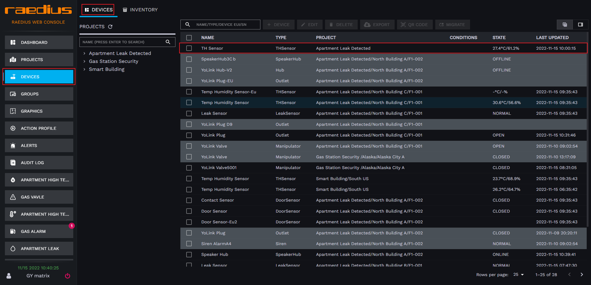  
3. 进入到设备详情后，切换标签页到设备 **ACTION PROFILE**

 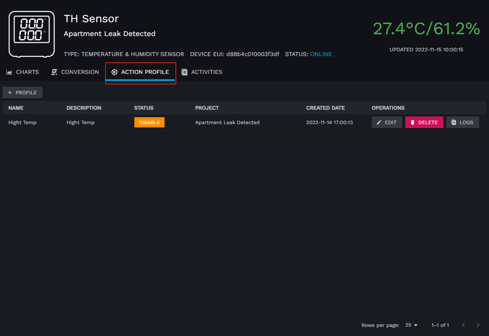  
4. 点击 **PROFILE** 按钮
5. 按照实际需求参考上面文档填写动作配置。
6. 点击 **SAVE** 按钮，完成动作配置创建

### 组级动作配置

#### 创建组动作配置

1. 点击左侧菜单 **GROUPS** 进入分组管理页
2. 单击右侧分组表格中操作列上的 **SETTINGS** 按钮打开分组设置页

 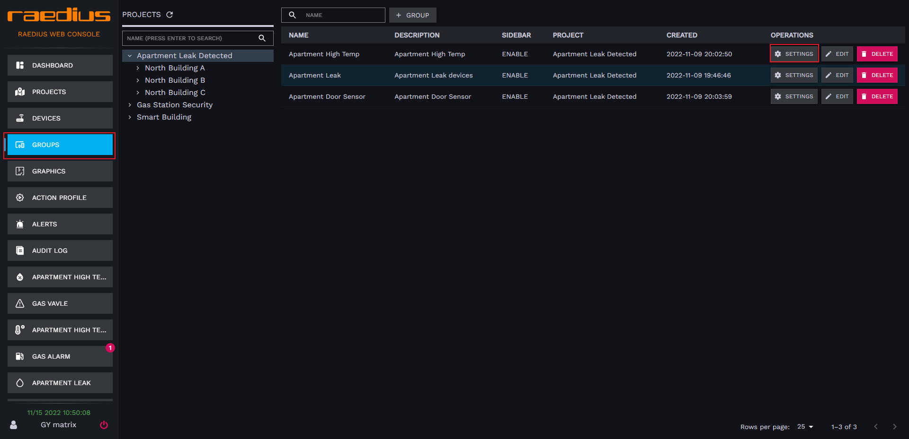  
3. 进入到分组详情后，切换标签页到设备 **ACTION PROFILE**

 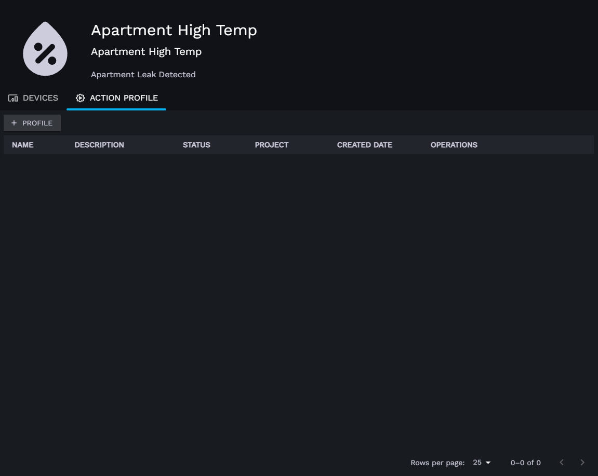  
4. 点击 **PROFILE** 按钮
5. 按照实际需求参考上面文档填写动作配置。
6. 点击 **SAVE** 按钮，完成动作配置创建

### 项目级动作配置

#### 创建项目动作配置

1. 点击左侧菜单 **ACTION RPFILE** 进入动作配置管理页
2. 单击右侧表格上方 **PROFILE** 按钮

 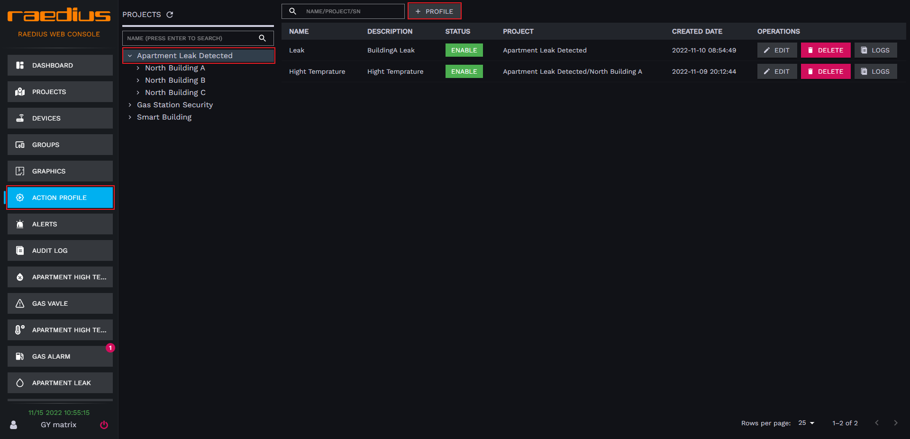  
3. 按照实际需求参考上面文档填写动作配置。
4. 点击 **SAVE** 按钮，完成动作配置创建