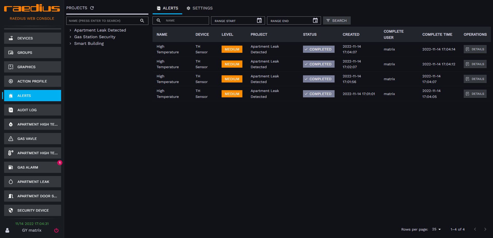
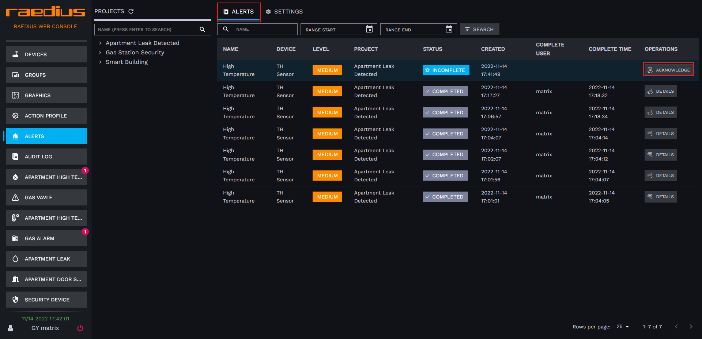
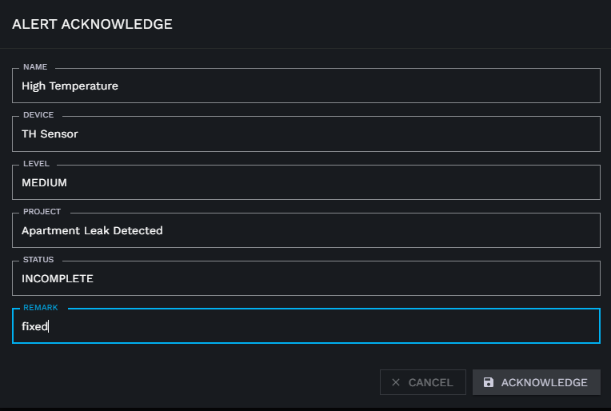
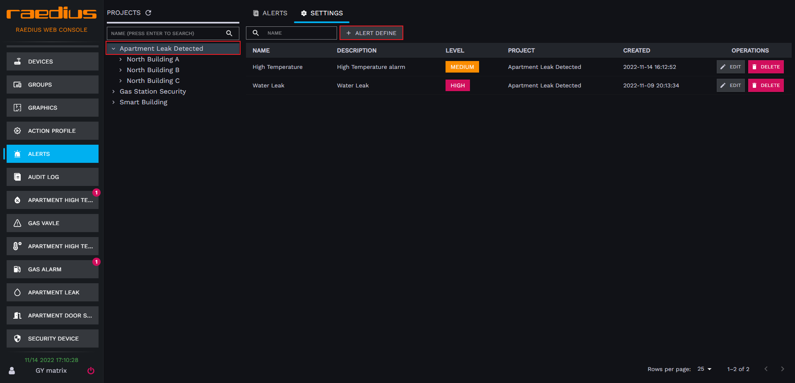
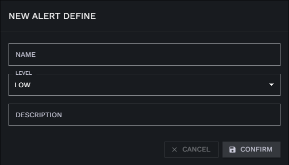
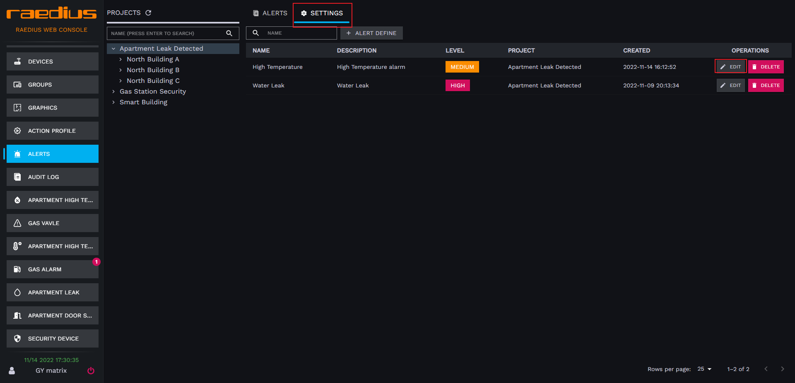
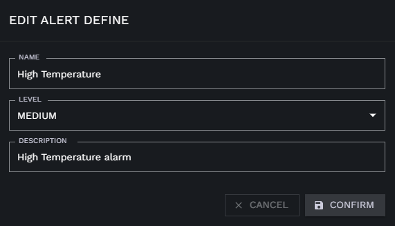
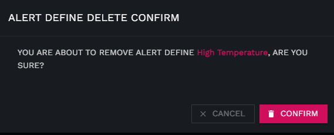

# 告警中心

告警中心用于集中管理用户定义的各种告警场景，我们可以在动作执行配置中关联将动作执行结果输出到告警中心，从而达到设备告警监控的目的。

## 告警历史

### 处理告警

1. 点击左侧 **ALERTS** 菜单，进入告警中心
2. 点击告警历史表格中操作列的 **ACKNOWLEDGE** 按钮

   
3. 在 **Remark** 填入处理结果，过程等(可选)

   
4. 点击 **ACKNOWLEDGE** 按钮，将告警标记为已处理

## 告警设置

### 定义告警

1. 点击左侧 **ALERTS** 菜单，进入告警中心
2. 点击左侧项目树，选择需要为其创建告警定义的项目
3. 切换标签到 **SETTINGS** 标签页
4. 点击 **ALERT DEFINE** 按钮

   
5. 在弹框中填写告警定义信息

   
   * name 告警名称
   * level 告警级别 (高、中、低)
   * description 告警描述信息
6. 点击 **CONFIRM** 按钮，完成告警定义创建

### 修改定义告警

1. 点击左侧 **ALERTS** 菜单，进入告警中心
2. 切换标签到 **SETTINGS** 标签页
3. 找到你所需要变更的告警定义记录，点击 **EDIT** 按钮

   
4. 在弹框中修改告警定义信息

   
5. 点击 **CONFIRM** 按钮，完成告警定义修改

### 删除定义告警

1. 点击左侧 **ALERTS** 菜单，进入告警中心
2. 切换标签到 **SETTINGS** 标签页
3. 找到你所需要删除的告警定义记录，点击 **DELETE** 按钮

   
4. 在弹出确认框中点击 **CONFIRM** 按钮，删除告警定义

   