# 设备管理

Raedius现仅支持YoSmart Lora设备接入。

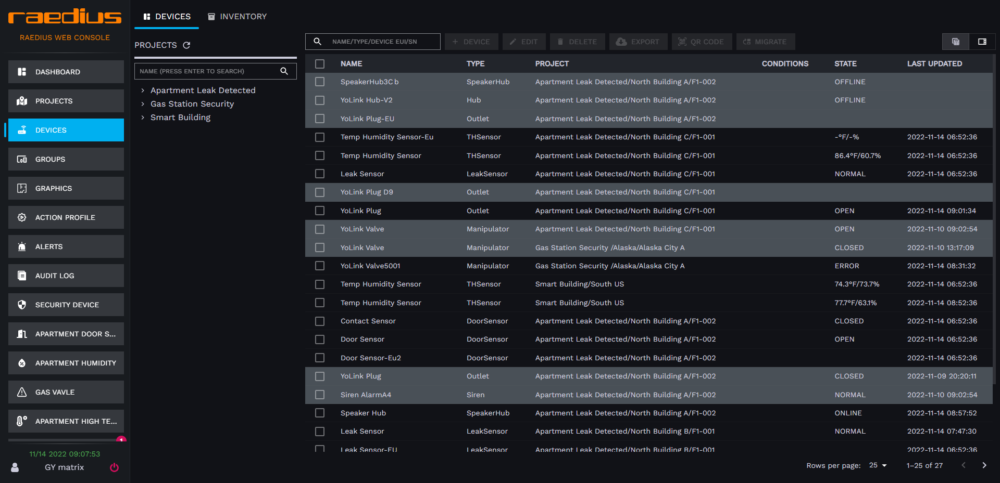

* 设备状态
  * 正常（设备处于在线状态并且设备没有任何告警相关信息）
  * 离线（设备处理离线状态，表格模式下为灰色背景、卡片模式下为闪烁）
  * 告警（设备处于告警状态，表格模式下为红色背景、卡片模式下为闪烁）
* 显示模式
  * 表格模式
  * 卡片模式
* 设备在线离线状态判断依据
  * 电池供电设备4小时没有数据上行则标记为设备离线
  * 直接供电设备爱30分钟没有数据上行则标记为离线

## 设备注册

支持的设备列表:

* Leak Sensor
* Tempeartur & Humidity Sensor
* Outlet
* Siren
* Hub & Speaker Hub
* Manipulator
* Door Sensor
* Lock
* Thermostat

Raedius现在支持两种设备注册方式
  
* 从设备二维码中获取设备SN码，通过SN码注册设备
* 通过YoLink APP同步到Raedius (推荐)

### 通过SN码注册设备

  1. 获取设备SN码，SN码被粘贴在设备的底部，你需要通过扫码软件获取设备的完整二维码（完整32位字符串)
  2. 进入Raedius控制台

   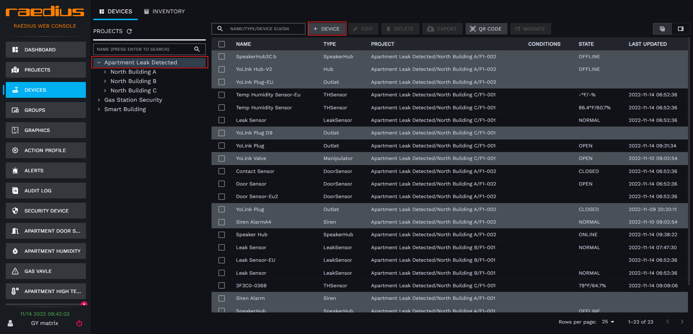  
  3. 从左侧项目树中选中你所希望添加设备所在的项目，点击右侧 **DEVICE** 按钮
  4. 在弹出框中输入 **设备名称**、**设备SN码**  

   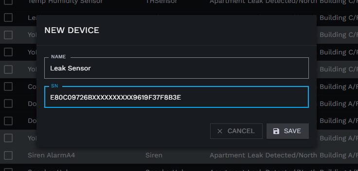  
  6. 确认无误后，点击 **SAVE** 保存

### 通过YoLink同步设备

  1. 通过 **谷歌应用商店** 或者 **App Store** 下载安装 **YoLink APP**
  2. 在 **YoLink APP** 上注册账号
  3. 通过 **YoLink APP** 扫描设备二维码完成设备注册
  4. 同步设备到Raedius, 打开Raedius设备管理页，切换标签页到 **INVENTORY**

   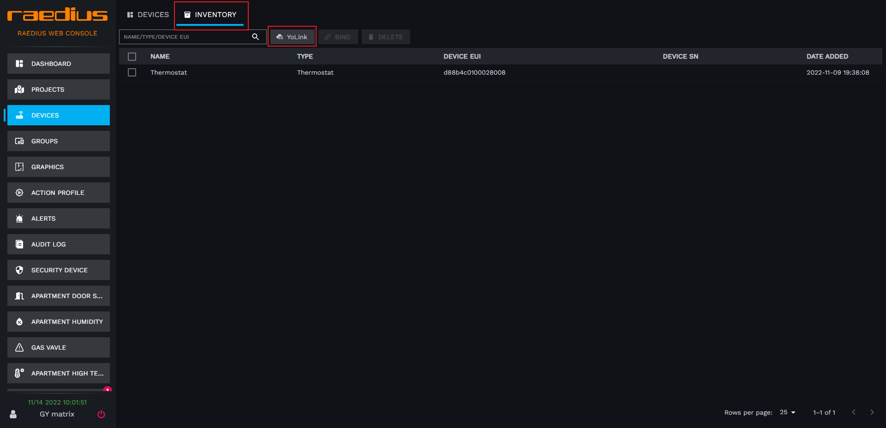  
  5. 点击 **YOLINK** 按钮
  6. 你将被重定向到YoSmart授权页面，在授权页面输入 **YoLink APP** 中注册的账户，点击登录即可完成设备同步到 Raedius
  7. 当设备被同步到库存后，设备还需要与项目建立关联，通过点击 **INVENTORY** 页面中的 **BIND** 按钮，从弹出框中选择设备关联的项目，点击 **CONFIRM** 按钮，即可完成设备与项目管理。

    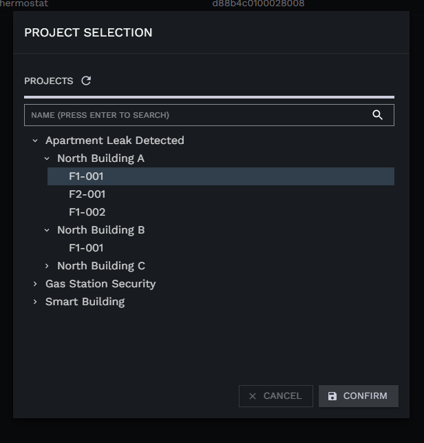  

  :::caution

  通过此方式添加到Raedus的设备，在未与项目建立关联前，设备处于未激活状态，Raedius将不会保持此设备任何上行数据。

  :::
  
## 设备名称修改

  1. 进入设备管理页，点击需要变更设备名称的设备记录前面的复选框
  
   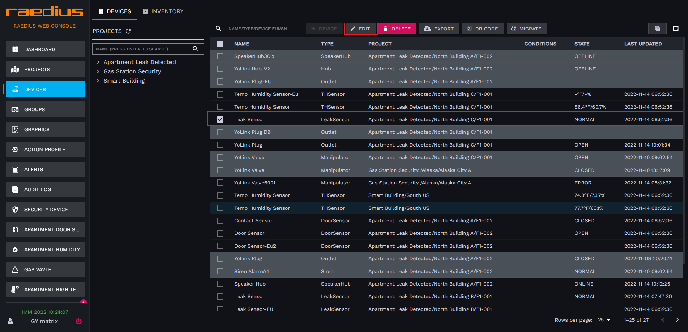  
  2. 点击表格顶部工具栏中的 **EDIT** 按钮，在设备信息弹框输入新的设备名称

   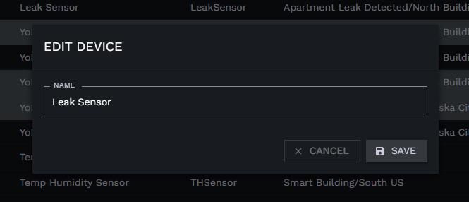  
  3. 点击**SAVE** 按钮，完成设备名称变更

## 设备迁移

  变更设备所属项目，设备归属权变更

  1. 进入设备管理页，点击需要进行迁移的设备记录前面的复选框
  
   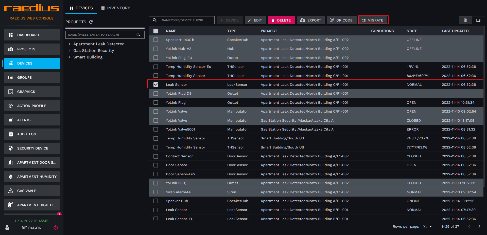  
  2. 点击表格顶部工具栏中的 **MIGRATE** 按钮，在弹出框中选择新项目

   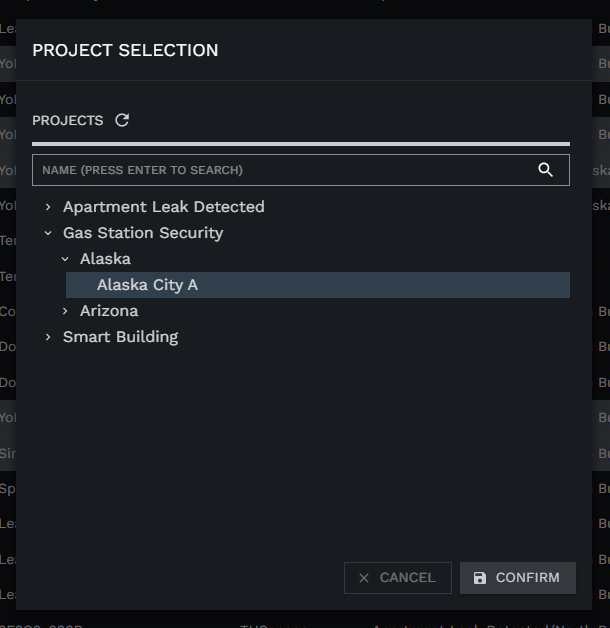  
  3. 点击**CONFIRM** 按钮，完成设备迁移。

  :::caution

  设备迁移后，设备的归属权发生变更，可能会导致，设备从分组、平面图中移除，基于组或者全局的动作执行配置失效。

  :::

## 设备删除

  1. 进入设备管理页，点击需要进行删除的设备记录前面的复选框
  
   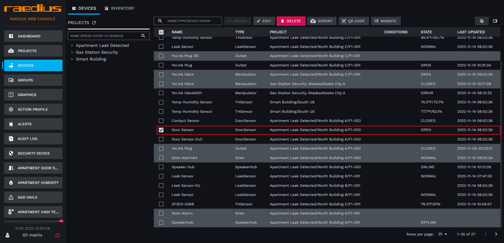  
  2. 点击表格顶部工具栏中的 **DELETE** 按钮

   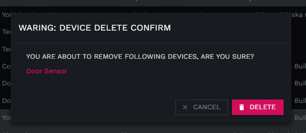  
  3. 点击**DELETE** 按钮，完成设备删除。

## 设备二维码导出

  1. 进入设备管理页，点击需要进行二维码的设备记录前面的复选框，或仅选择需要导出的项目（导出整个项目所有设备二维码)
  
   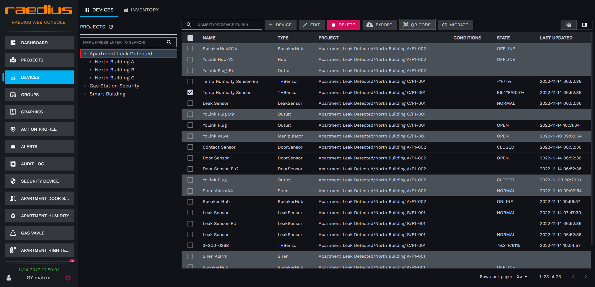  
  2. 点击表格顶部工具栏中的 **QR CODE** 按钮
  3. 在弹出信息框中填入接收二维码的邮件地址

   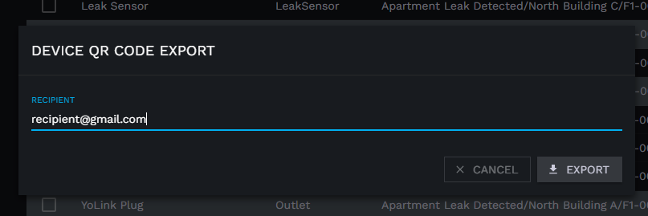  
  4. 点击**EXPORT** 按钮，Raedius 将会向该邮件地址发送一封邮件，并附带有包含设备二维码图片的PDF文件附件。

## 设备历史数据导出

  导出数据文件格式为Excel,现最大支持3个月内设备数据导出，导出数据视设备类型不同，数据格式也会存在差异，支持不同类型多设备数据同时导出，每个设备一个 Sheet.

  1. 进入设备管理页，点击需要进行数据导出的设备记录前面的复选框
  
   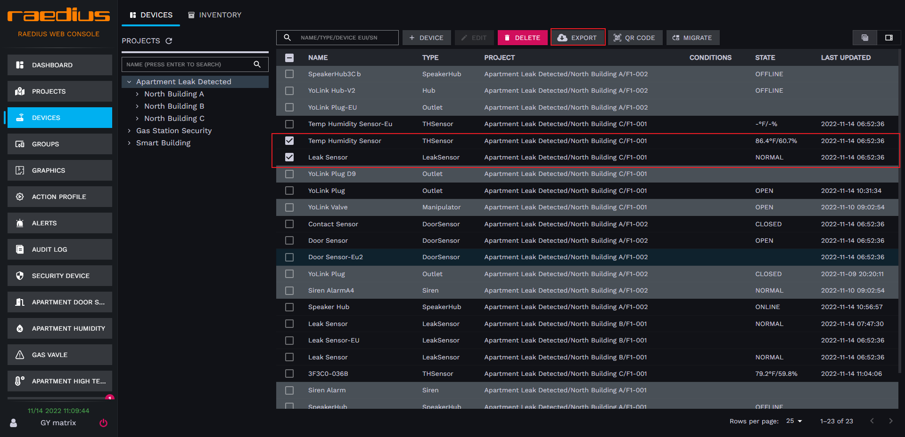  
  2. 点击表格顶部工具栏中的 **EXPORT** 按钮
  3. 在弹出时间范围选择弹框中选择数据时间范围
  
   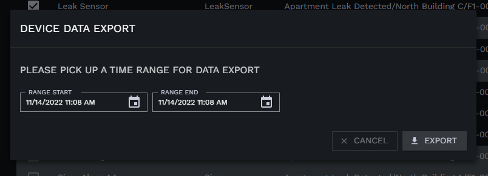  
  4. 点击**EXPORT** 按钮，完成设备数据导出。

## 设备详情页

  通过点击设备列表页，设备记录进入设备详情页

  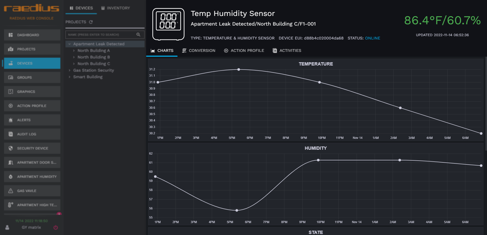

### DASHBOARD标签页
  
  Oulet、Manipulator、Siren、Thermostat、Lock、Hub、SpeakerHub 拥有此标签页

  SpeakerHub、Hub WIFI配网

  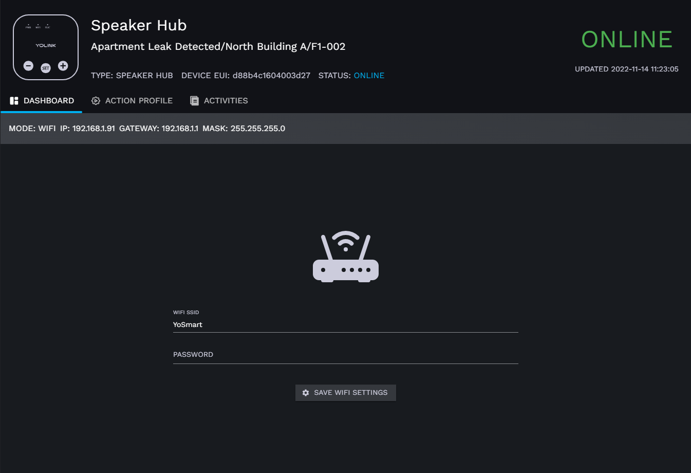

  1. 输入路由器 **SSID** 和 **密码**
  2. 点击 **SAVE WIFI SETTING** 按钮，完成Hub、Speaker Hub配网

### CHARTS 标签页

  除Hub、Speaker Hub外设备均拥有此标签页，用户展示24小时内设备属性变化趋势，X轴为时间，Y轴为具体设备属性值。

  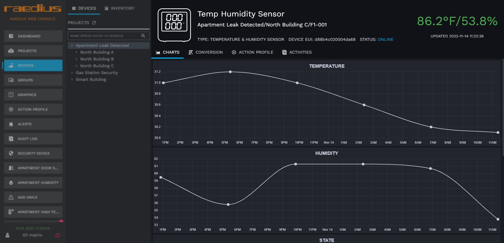

### CONVERSION 标签页

此功能允许用户在设备上行时，对数据进行处理，仅支持 javascript脚本

```js
var data = msg;
data.temperature += 0.1;
data.humidity += 1;
return data;
```

### ACTION PROFILE 标签页

点击 **[此处](../action-profile/)** 查看动作配置文档

### ACTIVITIES 标签页

动作配置记录设备的历史活动变更，如设备注册、设备状态变更、设备上线、下线等

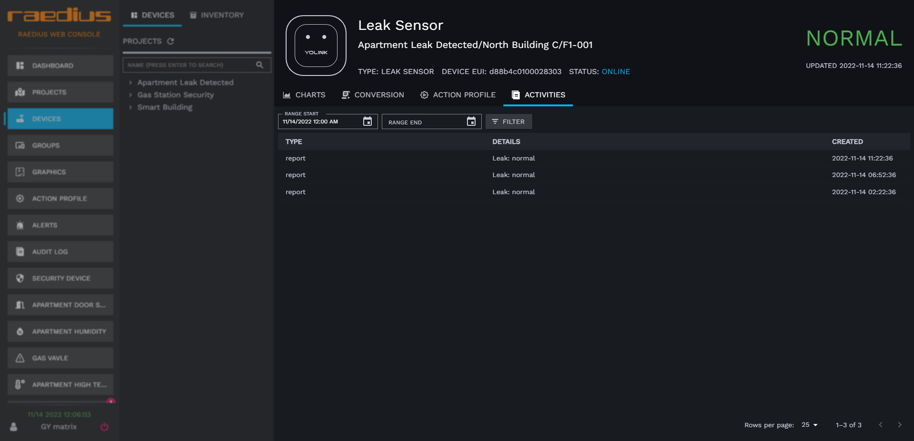  

:::caution
  仅支持查询3个月内的设备活动记录
:::

## 卡片视图

点击下面图示中的表格卡片视图切换按钮到卡片模式

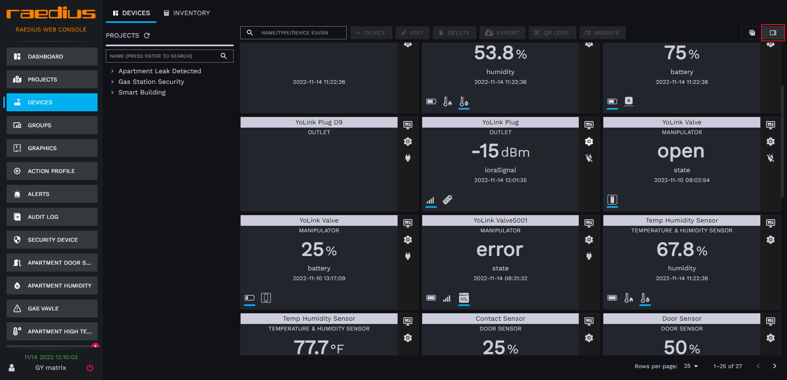  

### 设备卡片描述

* 设备名称显示区域  

  
* 设备类型显示区域

  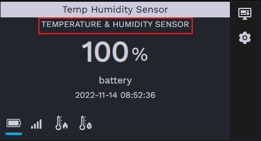
* 设备属性值显示区域

  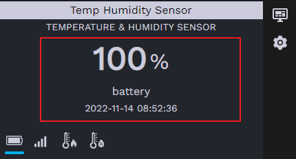
* 设备属性图标显示区域
  
  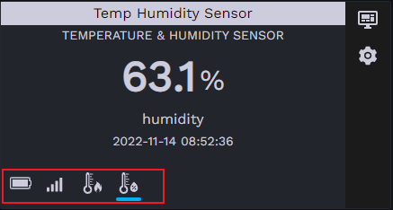
  
  默认设备属性会滚动显示，点击对应的属性图标可显示当前属性。
* 设备工具栏
  
  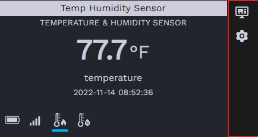

  * 卡片详情按钮
    点击工具栏中的图标  可打开设备详情页。
  * 点击工具栏中的图标  可打开设备卡片设置页。

    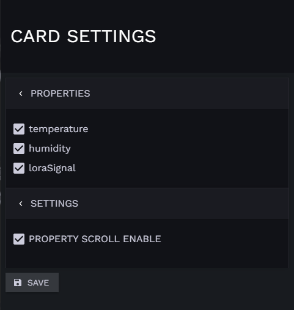  
    PROPERTIES 设置项，配置需要在卡片显示的设备属性  
    PROPERTY SCROLL ENABLE 设置项，属性是否滚动显示
  * 更多  
    根据不同类型设备，Raedius在右侧工具栏提供了部分设备控制的快捷方式，例如Outlet\Siren\Manipulator开关控制