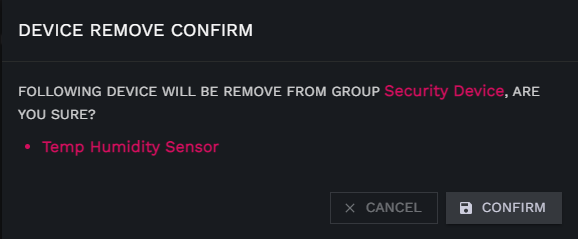

# 设备组

你可以根据你的使用需求对设备进行逻辑分组  
例如按照产品类型划分为：水浸监测、温湿度监测、开关控制等  
按照使用场景可以划分为：漏水检测、高温预警、低温预警等

## 创建设备分组

1. 进入设备分组管理页，选择左侧项目树需要为其创建分组的项目
2. 点击右侧 **GROUP** 按钮

   
3. 在弹出框填写分组信息
  
     
   * name 分组名称（必填）
   * description 分组描述 （选填）
   * sort 分组排序 （升序，数字越小排在越前面）
   * icon 分组图标，分组图标，点击 **[此处](https://icon-sets.iconify.design/)** 获取图标，或者直接访问 **[https://icon-sets.iconify.design/](https://icon-sets.iconify.design/)**
   * sidebar enable 是否在侧边栏显示
4. 点击**CONFIRM** 按钮，完成分组创建。

## 编辑设备分组

1. 进入设备分组管理页
2. 点击你所需要修改的设备组操作栏上的 **EDIT** 按钮

   
3. 在弹出框修改分组信息

   
4. 点击**CONFIRM** 按钮，完成分组信息变更。

## 删除设备分组

1. 进入设备分组管理页
2. 点击你所需要删除的设备组操作栏上的 **DELETE** 按钮

   

3. 点击**CONFIRM** 按钮，完成分组删除操作

  

## 设备分组设置

### 向分组中添加设备

1. 进入设备分组管理页
2. 点击你所需要添加设备的组操作栏上的 **SETTINGS** 按钮打开设备组信息页面

   

3. 点击分组详情页**DEVICE** 按钮，打开设备选择框

    
4. 从弹出的设备选择框中勾选需要添加到分组的设备前面的复选框

 
5. 点击 **CONFIRM** 按钮，完成设备添加。

### 从分组中移除设备

1. 进入设备分组管理页
2. 点击你所需要添加设备的组操作栏上的 **SETTINGS** 按钮打开设备组信息页面

   

3. 勾选需要进行移除的设备记录上的复选复选框，点击 **DELETE** 按钮

    
4. 在弹出确认框点击 **CONFIRM** 按钮，完成设备从分组中移除

 

### 分组动作执行配置

  点击 **[此处](../action-profile/)** 查看动作配置文档