# 平面图

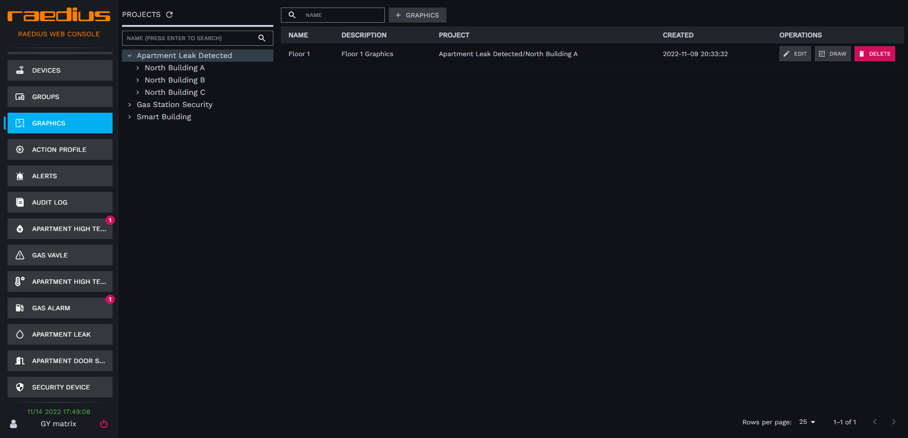

## 创建平面图

1. 点击菜单 **GRAPHCS**，进入平面图管理页，点击左侧项目树，选择需要为其创建平面图的项目
2. 点击右侧 **GRAPHCS** 按钮

   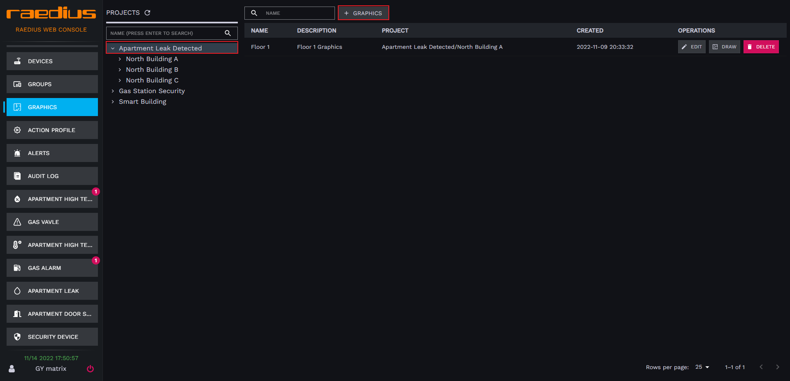
3. 在弹出框中输入平面图名称以及描述（描述可选）
  
   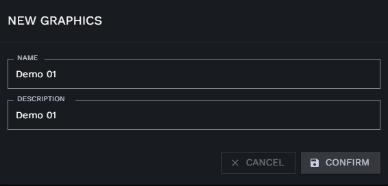  

4. 点击**CONFIRM** 完成平面图创建

## 编辑平面图

1. 点击菜单 **GRAPHCS**，进入平面图管理页
2. 点击右侧表格中操作栏的 **EDIT** 按钮

   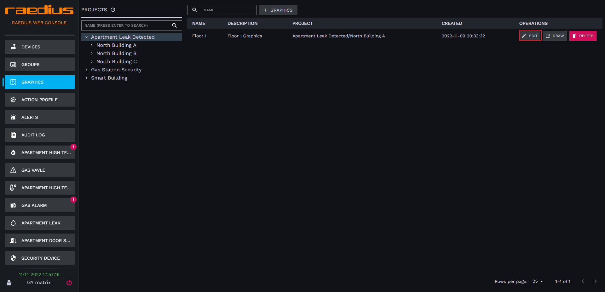
3. 在弹出框中变更平面图名称以及描述（描述可选）
  
   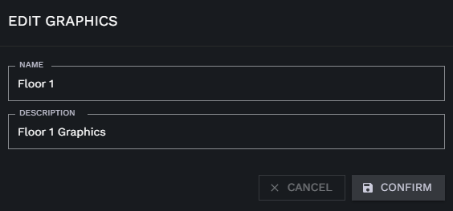  

4. 点击**CONFIRM** 完成平面图基础信息变更

## 删除平面图

1. 点击菜单 **GRAPHCS**，进入平面图管理页
2. 点击右侧表格中操作栏的 **DELETE** 按钮

   
3. 在弹出框确认框中点击 “CONFIRM" 完成平面图删除
  
   

## 平面图设备描点

1. 点击菜单 **GRAPHCS**，进入平面图管理页
2. 点击右侧表格中操作栏的 **DRAW** 按钮,跳转到平面图图纸管理页面

   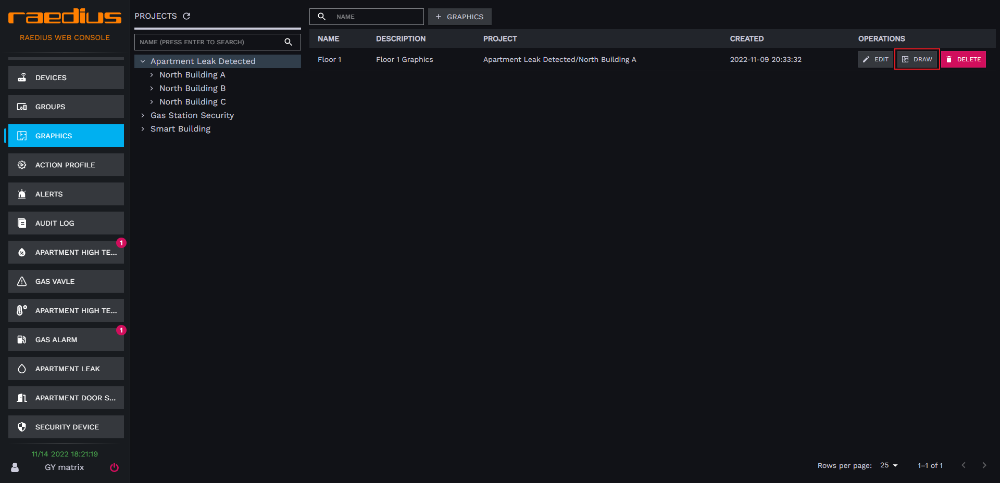
3. 点击导航菜单编辑图标,进入平面图编辑模式
  
   
4. 点击屏幕中央的 **UPLOAD** 按钮，上传图纸

   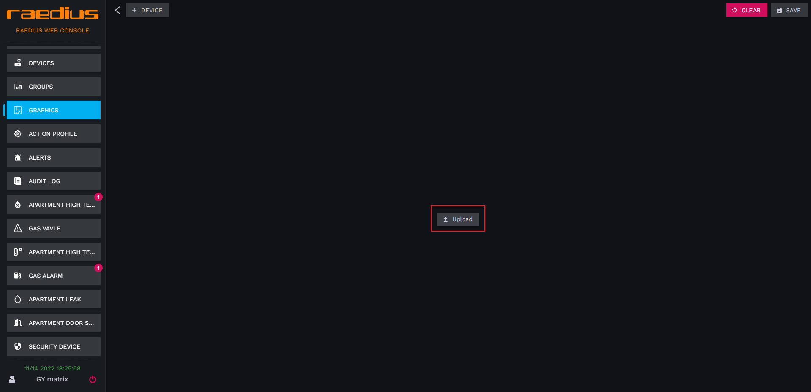
5. 浏览电脑文件上传平面图

   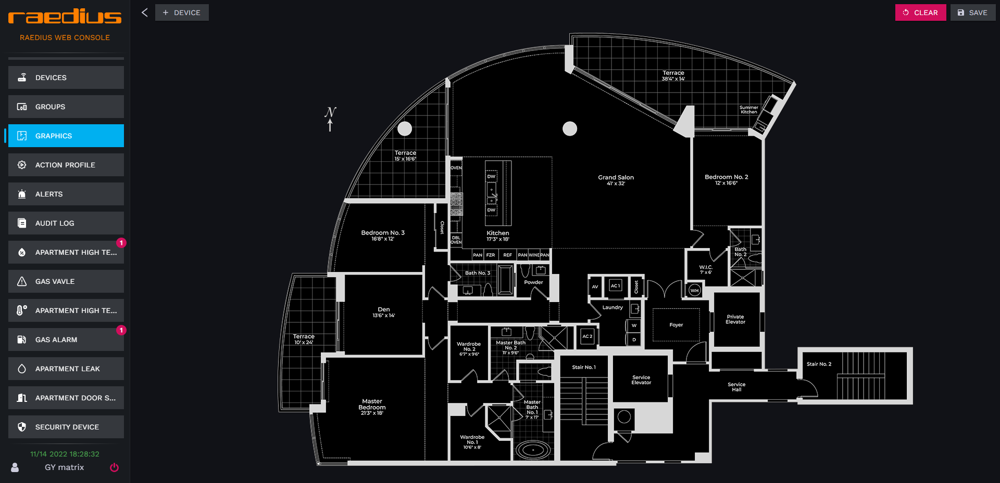

   :::tip
    你可以通过按住鼠标左键对平面图进行拖拽来移动图纸
   :::

6. 添加设备到平面图，通过点击屏幕左上角 **DEVICE** 按钮，检索设备，通过单击设备条目将设备添加到图纸

   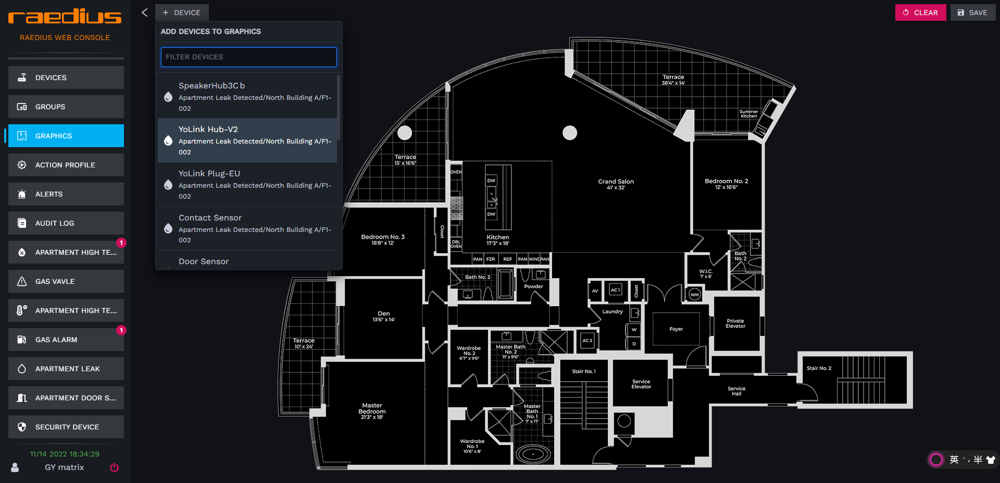
   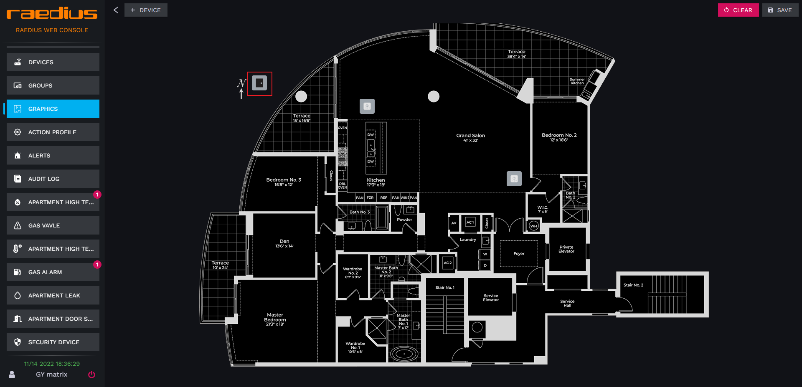
   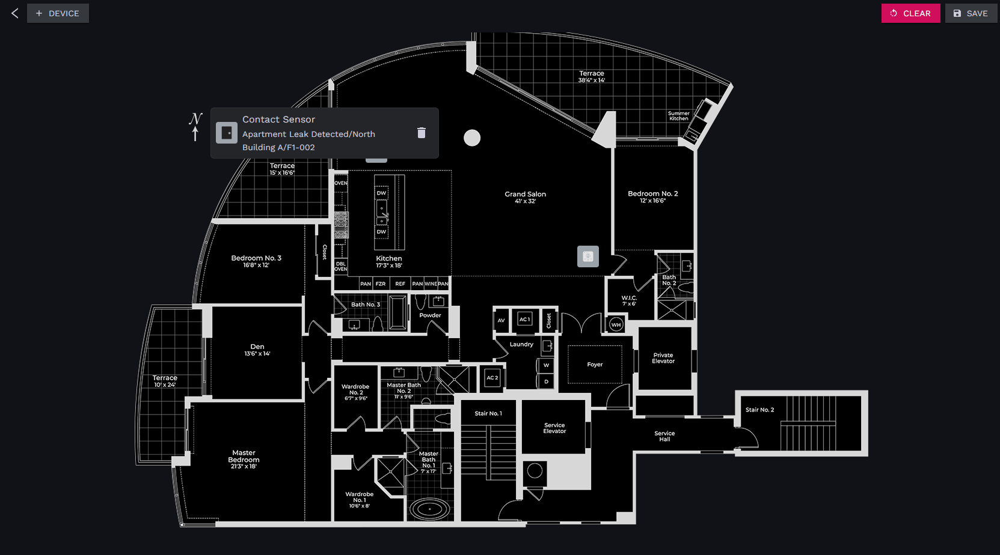
   :::tip
    将鼠标移到设备图标上方，按住鼠标左键，移动鼠标，将设备图标移动到平面图指定位置，松开左键即可完成设备标记
    点击设备图标，会展开设备简要信息，如果你想将图标从平面图中移除可以通过点击图标，然后点击右侧 **删除图标** 将设备从平面图中移除
   :::

7. 点击屏幕右上角的 **保存** 按钮进行保存，如果你想清空平面图内容可以通过点击右上角 **CLEAR** 按钮清除平面图内容

## 展示模式下平面图介绍

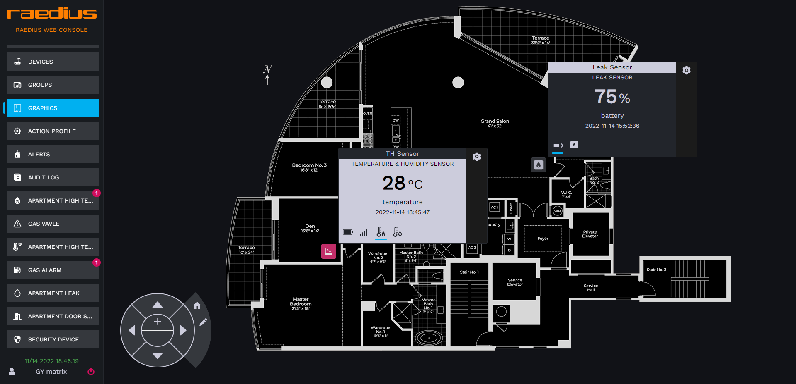

* 设备触发告警， 设备图标背景变红，设备卡片自动展开，卡片闪烁
* 设备离线， 设备图标背景变灰色，设备数据为最后一次上行数据
* 正常状态， 深色背景，正常显示各种设备属性